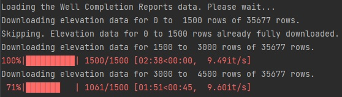
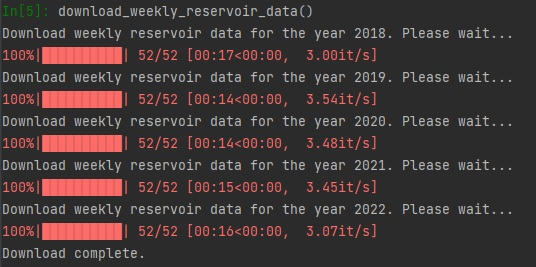

# How to Download the Datasets?
## The Datasets
This project uses many datasets from various sources on many different topics:
* Agriculture land use
* Groundwater measurements
* Total population estimates
* Weather stations precipitation measurements
* Water reservoirs
* Water shortage reports
* Soils survey
* Existing vegetation
* Well completion reports

In addition to the above datasets, additional geospatial data were used:
* Public Land Survey System (PLSS) Township-Range-Section (TRS) geospatial data
* California Counties geospatial data
* Land elevation

Original datasets were downloaded using 3 different methods:
* Direct download from the original source URL (most of the datasets)
* Web pages scraping (e.g. Precipitation data from weather stations)
* APIs
## Automated Dataset Download
For each dataset a custom library has been created in the `/lib` folder with a class for each dataset. Initiating the 
class loads the local data files from the `/assets/inputs/<dataset name>/` folder and if they are not found, 
automatically downloads the data either from the original source or from 
[a dedicated GitHub repository](https://github.com/mlnrt/milestone2_waterwells_data) where we provide some data
pre-packaged. 

Running the Jupyter Notebooks in the `/eda` folder will automatically download the data for the datasets corresponding
to the datasets used in the notebook. There is thus no need to manually pre-download any of the datasets in order to
run any of the EDA Jupyter Notebooks.

By automating the download of the original datasets we aim at: 
* ensuring that the data are correctly downloaded,
* simplifying the process for anyone trying to use the project
* improving the reproducibility of the project and the results.
## Pre-packaged Data
Some datasets take time to download through internet pages web scraping or API calls. For the same reasons as listed
above, and to limit the burden on API services, we provide a pre-packaged version of such the datasets in the 
[GitHub repository](https://github.com/mlnrt/milestone2_waterwells_data). 

Also, the soil survey dataset is a Microsoft Access database, making it complicated to automate the download. We thus,
manually extracted the data from the database and pre-packaged it.

This includes the following datasets:
* The 2014-2021 US Census Bureau American Community (ACS) 5-Year Estimates total population
* The soils survey data and geospatial data
* The elevation of all the wells in the well completion reports

In addition to the above datasets, we provide the following files in that GitHub repository which were manually created
by us for the project:
* A JSON mapping of all crop names to their respective type code
* A JSON mapping of all the existing vegetation type code to their names
## Downloading Original Datasets
### APIs
In the `/lib/download.py` custom library, we provide 2 functions to download some of the raw datasets instead of the 
pre-packaged ones:
* `download_population_raw_data()` to download the 2014-2021 US Census Bureau American Community (ACS) 5-Year Estimates 
total population
* `download_all_elevations()` to download the elevation of all the wells in the well completion reports

Taking the download of the ground surface elevation of all the wells in the well completion reports dataset, we used the
[The National Map - Elevation Point Query Service](https://nationalmap.gov/epqs/) API to collect the elevation of all 
the wells in the dataset, based on their latitude-longitude coordinates. The API call has the following format:

`https://nationalmap.gov/epqs/pqs.php?x=<longitude>&y=<latitude>&units=Meters&output=json`

There are 35,677 wells in the dataset. In order to speed up the download we:
* download the elevation in batches of 1,500 wells
* use multi-threading with 5 workers
* check if batches have already been downloaded and skip them if they have
* if the API throttles us, we wait for a few minutes and try again

To download the elevations, you can run the following Python code for the project root directory:
```python
import sys
sys.path.append(".")
from lib.download import download_all_elevations
download_all_elevations()
```

You will see the following output:


### Web Scraping
Some datasets 
were not downloaded directly or through APIs. They were downloaded using web scraping of the web pages using the 
Python package `BeautifulSoup`. This includes the following datasets:
* The reservoir geospatial data
* The reservoir measurements data
* The precipitation weather station geospatial data
* The monthly precipitation measurements data

All of these data were scraped from the 
[California Department of Water Resources Data Echange Center](https://cdec.water.ca.gov/).
Since
* the website is dedicated to data publication
* provides public data
* the [Conditions of Use](https://water.ca.gov/Conditions-of-Use) do not mention any restriction regarding web scraping
practices
* we provide the data pre-packaged in a dedicated [GitHub repository](https://github.com/mlnrt/milestone2_waterwells_data)
to avoid overloading the CDEC website with requests when reproducing the project.

we consider the web scraping of these data ethical and acceptable.

Should you want to see how we collected those data through web scraping or want to download the raw data instead of
the pre-packaged one, we provide in the `/llib/download.py` custom library the original functions we used to scrap the 
data:

| Feature Name | Description                                                                                                      |
|--------------|------------------------------------------------------------------------------------------------------------------|
| The reservoir geospatial data      | download_reservoir_stations_geospatial_data() |
| The reservoir measurements data      | download_weekly_reservoir_data() |
| The precipitation weather station geospatial data      | download_precipitation_stations_geospatial_data() |
| The monthly precipitation measurements data      | download_monthly_precipitation_data() |

For all 4 datasets, in the project's root directory, you can run the following Python code, replacing the function name
with the one corresponding to the dataset you want to download.
```python
import sys
sys.path.append(".")
from lib.download import download_weekly_reservoir_data
download_weekly_reservoir_data()
```

This is an example of the output when running the `download_weekly_reservoir_data()` function to download the weekly
reservoir measurements data.


## Code details
Please refer to the documented code in the `/lib/download.py` file for the technical details on how some of the 
original datasets were downloaded:
* Land elevation of the Well Completion Reports
* American Community Survey (ACS) total population estimates


