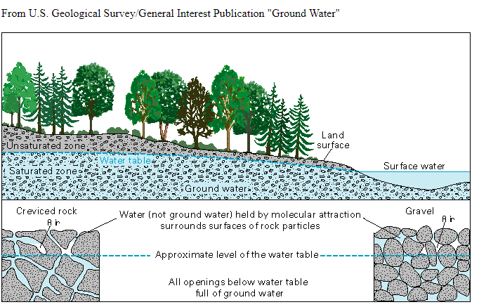

# [California Groundwater Measurements Dataset and Stations](https://data.cnra.ca.gov/dataset/periodic-groundwater-level-measurements)

## Description
Groundwater, which is found in aquifers below the surface of the earth, is one of our most important natural resources. 
Groundwater provides drinking water for a large portion of Califoria, nay, the nation's population. It also supplies 
business and industries, and is used extensively  for irrigation. California depends on groundwater for a major portion 
of its annual water supply, particularly during times of drought. This reliance on groundwater has resulted in overdraft
and unsustainable groundwater usage in many of California’s basins, particularly so in the San Joaquin River basin.

### What is groundwater?
Groundwater is water that exists underground in saturated zones beneath the land surface. The upper surface of the 
saturated zone is called the water table. Groundwater is a part of the natural water cycle. Some part of the 
precipitation that lands on the ground surface infiltrates into the subsurface. The part that continues downward 
through the soil until it reaches rock material that is saturated is groundwater recharge. Water in the saturated 
groundwater system moves slowly and may eventually discharge into  streams, lakes, and oceans. An aquifer is a body of 
rock and/or sediment that holds this groundwater.

The water level in an aquifer that supplies water to a well does not always remain the same. Factors affecting 
groundwater levels that are studied in this project include:
 1. Droughts
 2. Seasonal variations in precipitation
 3. Reservoir levels
 4. Pumping for human needs such as domestic, agriculture and industrial
 
If water is pumped at a faster rate than an aquifer is recharged by precipitation or other sources
of recharge, water levels drop. This can happen during drought, due to the extreme deficit of rain.

**Long-term water-level data** are fundamental to the resolution of many of the most complex problems dealing with 
groundwater availability and sustainability.  Significant periods of time - years to decades - typically are required 
to collect water-level data needed to assess the effects of climate variability, to monitor the effects of regional 
aquifer development, or to obtain data sufficient for analysis of water-level trends.

The analyis is performed against the backdrop of the 
[Sustainable Groundwater Management Act](https://water.ca.gov/programs/groundwater-management/sgma-groundwater-management) 
that was passed in 2014 in  California. SGMA requires locals agencies to form groundwater sustainability agencies (GSAs) 
for the high and medium priority basins.

## Source
We use 2 datasets provided by 
[The Department of Water Resources Periodic Groundwater Levels datasets](https://data.cnra.ca.gov/dataset/periodic-groundwater-level-measurements). 
* Long-term groundwater level measurements containing a time series measurement since 1900 
* The groundwater measurement stations information, containing the geolocation information

Datasets information:
* Organization: California Department of Water Resources
* Contact  Name: Water Data Library
* Title: Periodic Groundwater Level Measurements
* Resources, website: [https://data.cnra.ca.gov/dataset/periodic-groundwater-level-measurements](https://data.cnra.ca.gov/dataset/periodic-groundwater-level-measurements).

## How to download ?
The `GroundwaterDataset` class in the `/lib/groundwater.py` custom library is designed to load the groundwater 
measurements dataset and measurement stations geolocation geospatial datasets from the local 
`/assets/inputs/groundwater/` folder. If files are not found, both the measurements and the stations data are 
automatically downloaded from the 
[Periodic Groundwater Level Measurements](https://data.cnra.ca.gov/dataset/periodic-groundwater-level-measurements) 
page, when running the `/eda/groundwater.ipynb` notebook. 

The datasets can be manually downloaded from the 
[Periodic Groundwater Level Measurements](https://data.cnra.ca.gov/dataset/periodic-groundwater-level-measurements) 
page, using the download button. APIs are also provided but only 4,000 rows can be downloaded at a time.

## Features of interest
We are interested in the elevation of the groundwater surface, that can be calculated by subtracting the depth to 
groundwater from the ground surface elevation.

[DECIDING WHEN TO MONITOR GROUNDWATER LEVELS](https://www.countyofcolusa.org/DocumentCenter/View/4260/Series1Article4-GroundwaterLevelMonitoring?bidId=#:~:text=The%20elevation%20of%20the%20groundwater,groundwater%20flow%20can%20be%20determined.&text=Figure%201.)

Water levels in many aquifers in the United States follow a natural cyclic pattern of seasonal fluctuation,typically 
rising during the winter and spring due to greater precipitation and recharge, then declining during the summer and 
fall owing to less recharge and greater evapotranspiration. Spring measurements generally occur before most of the 
irrigation season so static groundwater levels are usually measured in production wells.Because static levels are 
measured, elevation gradients between monitoring wells can be determined as well as groundwater flow direction within 
the aquifer systems. Spring time measurements also indicate the extent that the storage in the aquifer systems has 
recharged from winter precipitation.

Hence, we filter for spring measurements of groundwater.

| Feature Name | Description                                                                                                      |
|--------------|------------------------------------------------------------------------------------------------------------------|
| GSE_GWE      | Ground Surface Elevation to Groundwater Elevation - Depth to groundwater elevation in feet below ground surface |
## Mapping at the TRS level
Please refer to this documentation [Overlaying San Joaquin Valley Township Boundaries](doc/etl/township_overlay.md)
## Potential issues
### Description
1. As shown in the `/eda/groundwater.ipynb` 8% of the measurements have missing `GSE_GWE` data, our feature of interest
### How did we remediate the issues?
1. Rows without `GSE_GWE` data are simply ignored
