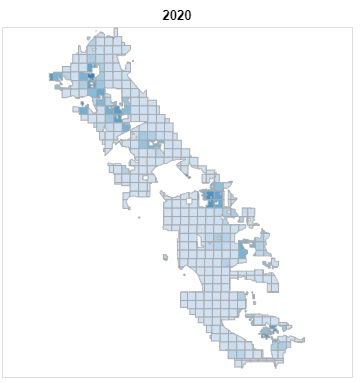

# The Tract Level Population Density Dataset

## Description
The population density of an area is a feature of interest in our analysis of well water shortage in 
San Joaquin valley river basin. 

## Source
We use 3 datasets from the U.S. Census Bureau::
* The American Community Survey 5-Year Data to collect the population estimates per year and Tract for the 2014-2020 
period.
* The Census Bureau's Planning Database (PDB) to collect California census 2019 tracts land surface area to calculate 
population density. As we do not expect census Tracts boundaries to change from year to year, we used the latest data
available and used them for every year.
* The Census Bureau's 2019 TIGER/Line Shapefiles to collect the Tracts geospatial data.

The American Community Survey (ACS) dataset information:
> The American Community Survey (ACS) is an ongoing survey that provides data every year -- giving communities the 
> current information they need to plan investments and services. The ACS covers a broad range of topics about social, 
> economic, demographic, and housing characteristics of the U.S. population.

Citation information:
* Organization: U.S. Census Bureau
* Publication Date: 04-10-2016
* Title: American Community Survey: 5-Year Estimates: Detailed Tables 5-Year
* Resources, website: [https://www.census.gov/data/developers/data-sets/acs-5year.html](https://www.census.gov/data/developers/data-sets/acs-5year.html)

Census Bureau's Planning Database (PDB) dataset information:
> The 2021 Tract Level Planning Database (also called the PDB) is a datasetthat contains a range of 
> housing, demographic,socioeconomic, and census operational data. These datahave been extracted 
> from2010 Census and 2015-2019 American Community Survey (ACS) data sources, and summarized for 
> all tracts in the country and the territory of Puerto Rico.

Citation information:
* Organization: U.S. Census Bureau
* Publication Date: 04-10-2016
* Title: 2021 Planning Database (PDB)
* Resources, website: [https://www.census.gov/data/developers/data-sets/acs-5year.html](https://www.census.gov/data/developers/data-sets/acs-5year.html)

The Census Bureau's 2019 TIGER/Line Shapefiles dataset information:
> The TIGER/Line Shapefiles are extracts of selected geographic and cartographic information from the
> Census Bureau's Master Address File (MAF)/Topologically Integrated Geographic Encoding and
> Referencing (TIGER) Database (MTDB). The shapefiles include polygon boundaries of geographic areas and features.

Citation information:
* Organization: U.S. Census Bureau
* Publication Date: 09-08-2019
* Title: TIGER/Line Shapefiles
* Resources, website: [https://www.census.gov/geographies/mapping-files/time-series/geo/tiger-line-file.html](https://www.census.gov/geographies/mapping-files/time-series/geo/tiger-line-file.html)

## How to download ?
The `PopulationDataset` class in the `/lib/population.py` custom library is designed to load pre-packaged total 
population dataset from and the Tracts geospatial dataset from the local `/assets/inputs/population/` folder. If files 
are not found, the data are automatically downloaded. As the Census Bureau API requires an API key, the
total population from [a dedicated Github repository](https://github.com/mlnrt/milestone2_waterwells_data) where we 
provide some prepackaged datasets. The Census Bureau's 2019 TIGER/Line Shapefiles dataset is downloaded directly
from the [census bureau website](https://www.census.gov/geographies/mapping-files/time-series/geo/tiger-line-file.html).

As mentioned above, as the Census Bureau's API requires an API key, the population data for the years 2014-2020 has been
pre-packaged to simplify the download process and reproducibility of this project. Originally, the population size and 
Tracts land are surface data were both downloaded using the 
[census bureau API](https://www.census.gov/data/developers.html). 

__The Population Size Data:__

We collected the population size data between the years 2014 and 2020 for all the Tracts and Counties in the state of 
California. The population size estimate is in the `B01003_001E` variable 
[as described in the ACS5 dataset variable documentation](https://api.census.gov/data/2020/acs/acs5/variables.html).
To collect all data for the years 2014-2020, we used the following API call:

`https://api.census.gov/data/{year}/acs/acs5?get=B01003_001E&=&for=tract:*&in=county:*&in=state:06&key={token}`

__The Tracts Land Area Data:__
We collected the 2019 Tracts land area data which are available in the 2021 PDB dataset. The land area is in the 
`LAND_AREA` variable 
[as described in the PDB Tract dataset variable documentation](https://api.census.gov/data/2021/pdb/tract/variables.html).
We used the following API call to collect the data:

`https://api.census.gov/data/2021/pdb/tract?get=LAND_AREA&for=tract:*&in=county:*&in=state:06&key={token}`

## Features of interest
From the American Community Survey (ACS) 2014-2020 datasets we are interested in the following information:

| Feature Name | Description               |
|--------------|---------------------------|
| state        | the state FIPS code       |
| county       | the county FIPS code      |
| tract        | the tract FIPS code       |
| B01003_001E  | the total population size |

From the Census Bureau's Planning Database (PDB) 2021 dataset we are interested in the following information:

| Feature Name | Description                           |
|--------------|---------------------------------------|
| state        | the state FIPS code                   |
| county       | the county FIPS code                  |
| tract        | the tract FIPS code                   |
| LAND_AREA    | the Tract land area surface is sq.mi. |

From the Census Bureau's 2019 TIGER/Line Shapefiles dataset we are interested in the following information:

| Feature Name | Description                                                                                |
|--------------|--------------------------------------------------------------------------------------------|
| TRACTCE      | the state-county-tract FIPS code                                                           |
| geometry     | the polygon shapes of Tract. The polygon coordinates must be converted to EPSG:4326 format |

To map the Tracts geospatial data with their population size and land area, we merged the datasets based on the 
state-county-tract FIPS code. The population density was computed for every year as the population size divided by the 
Tract land area.

The features generated and provided pre-packaged in the 
[dedicated Github repository](https://github.com/mlnrt/milestone2_waterwells_data) are :

| Feature Name | Description                                                                                |
|--------------|--------------------------------------------------------------------------------------------|
| TRACTID      | the state-county-tract FIPS code                                                           |
| YEAR         | the year of the population density estimate                                                |
| POP_DENSITY  | the population density estimate                                                            |
| geometry     | the polygon shapes of Tract. The polygon coordinates must be converted to EPSG:4326 format |

## Mapping at the Township-Range level
Please refer to this documentation [Overlaying San Joaquin Valley Township Boundaries](doc/etl/township_overlay.md)

## Potential issues
### Description
1. The 2020 American Community Survey (ACS) data are incomplete. In the San Joaquin Valley some Tracts are missing as
can be seen on this map.

2. The Census Bureau does not provide yet American Community Survey data for 2021. 
### How did we remediate the issues?
1. We estimated the missing 2020 Tracts population size, using the 2019 population size and the 2018-2019 trend.
2. We estimated the missing 2021 Tracts population size, using the updated 2020 population size and the 2019-2020 trend.

