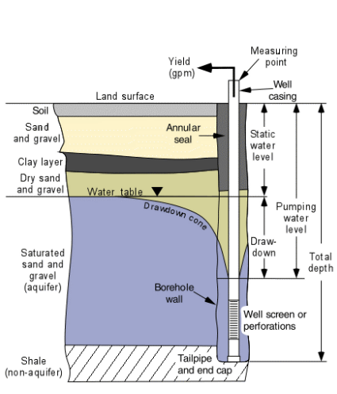
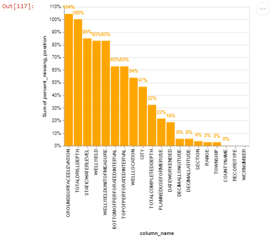

# [California Well Completion Report Dataset](https://data.cnra.ca.gov/dataset/well-completion-reports)

## Description
This Well Completion Report dataset represents an index of records from the California Department of Water Resources' 
(DWR) Online System for Well Completion Reports (OSWCR). Limited spatial resolution: The majority of well completion 
reports have been spatially registered to the center of the 1x1 mile Public Land Survey System section that the well is 
located in. Water well completion reports or "well logs" include information about well including the construction, 
location, yield, geology, and depth. 

## Source
The datasets are provided by the [__California Natural Resources Agency__](https://resources.ca.gov/) representing
_an index of records from the California Department of Water Resources' (DWR) Online System for Well Completion Reports
(OSWCR)_.

Dataset information:
* Organization: California Department of Water Resources
* Originator: Benjamin Brezing
* Title: Well Completion Reports
* Updated: weekly
* Resources, website: 
[https://data.cnra.ca.gov/dataset/well-completion-reports](https://data.cnra.ca.gov/dataset/well-completion-reports)

## How to download ?
The `WellCompletionReportsDataset` class in the `/lib/well.py` custom library is designed to load the well
completion report CSV datasets from the local `/assets/inputs/wellcompletion/` folder. If files are not found the well
completion reports data are automatically downloaded from the 
[California Well Completion Reports](https://data.cnra.ca.gov/dataset/well-completion-reports) page, when running the 
`/eda/well_completion.ipynb` notebook. The missing  elevation data were downloaded using API but are provided 
prepackaged in [a dedicated GitHub repository](https://github.com/mlnrt/milestone2_waterwells_data). These data are 
also automatically downloaded. 

The elevation data were collected using APIs from the 
[The National Map - Elevation Point Query Service](https://nationalmap.gov/epqs/). You can refer to the code in the
`/lib/get_elevation.py` Python script for the code used to collect the elevation data. These data are prepackaged and
provided to you in [a dedicated GitHub repository](https://github.com/mlnrt/milestone2_waterwells_data) we create to
ease the collection of the data and the repeatability of the analysis.

```Python
import requests
url = 'https://nationalmap.gov/epqs/pqs.php?'  

def elevation_function(df, lat_column, lon_column):
    """Query service using lat, lon. add the elevation values as a new column."""
    elevations = []
    for lat, lon in zip(df[lat_column], df[lon_column]):

        # define rest query params
        params = {
            'output': 'json',
            'x': lon,
            'y': lat,
            'units': 'Meters'
        }

        # format query string and return query value
        result = requests.get((url + urllib.parse.urlencode(params)))
        elevations.append(result.json()['USGS_Elevation_Point_Query_Service']['Elevation_Query']['Elevation'])

    df['elev_meters'] = elevations
    return df
```

**Note:**
The public dataset site offers [Data API access](https://data.cnra.ca.gov/api/1/util/snippet/api_info.html?resource_id=8da7b93b-4e69-495d-9caa-335691a1896b) along with examples that show how to retrieve filtered
data. For instance, it provides the following example for Python, which was employed to gather the data programatically. 

```Python
import json
import urllib.request
url = 'https://data.cnra.ca.gov/api/3/action/datastore_search?resource_id=8da7b93b-4e69-495d-9caa-335691a1896b&limit=5&q=title:jones'  
fileobj = urllib.request.urlopen(url)
response_dict = json.loads(fileobj.read())
print(response_dict)
```

## Features of interest
A deep study of well construction and aquifers had to be conducted to understand the features. The understanding has 
been distilled below and features are explained. The columns specified here are as per original dataset name:

[Explanation of geologic terms](https://mbmggwic.mtech.edu/sqlserver/v11/help/welldesign.asp)



> **Aquifer**: An aquifer is a geologic unit (sand and gravel, sandstone, limestone, or other rock) that will yield 
> usable amounts of water to a well or spring.

> **Perforations**: All wells are open to the aquifer so that water can enter the well. Well completions vary from 
> "open hole" in consolidated rock that does not need a casing,  to "open bottom" where the only way for the water to 
> enter the well is through the end of the casing. However, many wells have some sort of well screen installed or 
> perforations cut into  the casing through which water can enter. The openings must be correctly sized so that water 
> will enter, but sand and other aquifer materials do not.

> **Static water level**: The static water level is the distance from the land surface (or the measuring point) to the 
> water in the well under non-pumping (static) conditions. Static water levels can be influenced by climatic conditions 
> and pumping of nearby wells and are often measured repeatedly to gain information about how aquifers react to 
> climatic change and development.

> **Total depth**: The total depth of the well is the distance from land surface to the bottom.

> **Casing**: Steel or plastic pipe placed in the borehole to keep it from collapsing. The casing is sealed to the 
> borehole wall near the land surface with the annular seal.

> **Ground Surface Elevation** Measuring the depth to groundwater below the ground surface is more informative if the 
> elevation of the ground surface is known.  This can either be measured by surveying from a benchmark of a known 
> elevation to a reference point on the well or estimated from topographic maps. The elevation of the groundwater 
> surface then can be calculated by subtracting the depth to groundwater from the ground surface elevation. Then, 
> comparisons of groundwater elevations can be made between monitoring well locations and the direction and gradient 
> of groundwater flow can be determined. 

> **Typical well depth** Domestic wells are generally shallow, limited to the top 50 to 100 feet of the Alluvial 
> aquifer system. Agricultural wells are usually deeper than domestic wells, commonly 200 to 400 feet deep or deeper. 
> The well casing of agricultural wells is often perforated at various depths transmitting water from more than one 
> aquifer system (i.e. the Alluvial aquifer system and the Tuscan or Tehama Aquifer systems depending where the well 
> is located).

> **Pumping water level**: The pumping water level is the distance from the land surface (or measuring point) to the 
> water in the well while it is pumping. The time that the pumping water level was measured is usually recorded also. 
> For example, "The pumping water level was 85 feet below land surface, 1 hour after pumping began."

> **Drawdown** : The drawdown in a well is the difference between the pumping water level and the static (non-pumping) 
> water level. Drawdown begins when the pump is turned on and increases until the well reaches "steady state" sometime 
> later. Therefore, drawdown measurements are usually reported along with the amount of time that has elapsed since 
> pumping began. For example, "The drawdown was 10 feet, 1 hour after pumping began."

> **Yield**: The amount of water measured in **gallons per minute** a well will produce when pumped.

| Feature Name               | Description                                                                                                                                           |
|----------------------------|-------------------------------------------------------------------------------------------------------------------------------------------------------|
| DECIMALLATITUDE            | Latitudinal position of the well                                                                                                                      |
| DECIMALLONGITUDE           | Longitudinal position of the well                                                                                                                     |
| WELLLOCATION               | Address of location, typically postal                                                                                                                 |
| BOTTOMOFPERFORATEDINTERVAL | Bottom of the screen/perforation that is the opening to the aquifer                                                                                   |
| TOPOFPERFORATEDINTERVAL    | Top of the screen/perforation that is the opening to the aquifer                                                                                      |
| GROUNDSURFACEELEVATION     | See definition above                                                                                                                                  |
| STATICWATERLEVEL           | The static water level is the distance from the land surface (or the measuring point) to the water in the well under non-pumping (static) conditions. |
| RECORDTYPE                 | This indicates if the well completion report is for a new construction, modification or repair.                                                       |
| PLANNEDUSEFORMERUSE        | Usage description from which we retrieve mention of Agricultural. Domestic, Public and Industrial use                                                 |
| WCRNUMBER                  | Unique well identifier                                                                                                                                |
| TOTALDRILLDEPTH            | Drilled depth of well                                                                                                                                 |
| TOTALCOMPLETEDDEPTH        | Completed depth of well                                                                                                                               |
| DATEWORKENDED              | Date of completion of well construction                                                                                                               |
| CASINGDIAMETER             | See definition above                                                                                                                                  |
| TOTALDRAWDOWN              | See definition above                                                                                                                                  |
| WELLYIELD                  | Amount of water yielded (See definition above)                                                                                                        |

We keep only the well completion reports with a `RECORDTYPE` indicating the completion of a new well. Based on the above
features we compute the below features per Township-Range and year:

| Feature Name                   | Description                                                           |
|--------------------------------|-----------------------------------------------------------------------|
| BOTTOMOFPERFORATEDINTERVAL_AVG | The average of BOTTOMOFPERFORATEDINTERVAL                             |
| TOPOFPERFORATEDINTERVAL_AVG    | The average of TOPOFPERFORATEDINTERVAL                                |
| GROUNDSURFACEELEVATION_AVG     | The average of GROUNDSURFACEELEVATION                                 |
| STATICWATERLEVEL_AVG           | The average of STATICWATERLEVEL                                       |
| TOTALDRILLDEPTH_AVG            | The average of TOTALDRILLDEPTH                                        |
| TOTALCOMPLETEDDEPTH_AVG        | The average of TOTALCOMPLETEDDEPTH                                    |
| CASINGDIAMETER_AVG             | The average of CASINGDIAMETER                                         |
| TOTALDRAWDOWN_AVG              | The average of TOTALDRAWDOWN                                          |
| WELLYIELD_AVG                  | The average of WELLYIELD                                              |
| WELL_COUNT                     | The total number of new wells per Township-Range and year             |
| WELL_COUNT_AGRICULTURE         | The total number of new agriculture wells per Township-Range and year |
| WELL_COUNT_DOMESTIC            | The total number of new domestic wells per Township-Range and year    |
| WELL_COUNT_INDUSTRIAL          | The total number of new industrial wells per Township-Range and year  |
| WELL_COUNT_PUBLIC              | The total number of new public wells per Township-Range and year      |

## Mapping at the TRS level
To compute well data per Township-Range we use the following approach:
1. We overlay the Township-Ranges boundaries on the well geolocation information and group wells by Township-Range.
2. We count the number of wells per Township-Range and year in the `WELL_COUNT` feature.
3. For each well category (`AGRICULTURE`, `DOMESTIC`, `INDUSTRIAL`, `PUBLIC`), we count the number of wells per Township-Range 
and year in the `WELL_COUNT_AGRICULTURE`, `WELL_COUNT_DOMESTIC`, `WELL_COUNT_INDUSTRIAL`, `WELL_COUNT_PUBLIC` features.
4. We compute the average of each feature per Township-Range and year (e.g. `WELLYIELD_AVG`).
5. Township-Ranges without any new well completion reported get a value of 0 for all the `WELL_COUNT_*` features 

## Potential issues
### Description
1. 96% ot the records in the well completion reports have missing `GROUNDSURFACEELEVATION`
2. Several fields have incorrect values (e.g. incorrect Latitude, Longitude, Record Type, Planned Use, Total Completed 
Depth) 
3. Several fields have missing data

### How did we remediate the issues?
1. For all the records, we extracted their latitude and longitude coordinates and queried the 
[The National Map - Elevation Point Query Service](https://nationalmap.gov/epqs/) API to collect the elevation of all 
the wells in the dataset. The elevations were later merged with the original dataset based on latitude and longitude.
Please refer to the [Original Datasets Download](doc/assets/download.md) documentation for more details.
2. Depending on the fields we used several approach to correct the values:
   * Convert all positive longitudes to negative values and negative latitudes to positive values. 
   * Latitude and Longitude records in some cases contained text. These records do not yield the right location and were 
   hence dropped.
   * Wells with a depth less than 20 feet were dropped (see typical well depth above).
   * Drop data were text is provided in place of a well depth
3. We plotted missing values and decided to leave to downstream process the task to fill in the missing values.

