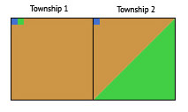

# Dropping Rare Township-Range Features
## What is the Problematic?
By gathering for each Township-Range (in the TRS system) data like soil, crops and vegetation types generates a vast 
amount of sparse features.

For the San Joaquin Valley, there are for example:
* 22 soil types defined by their soil taxonomy order and hydrologic group
* 8 crops classes and 95 crop types + 5 land use classes (idle, urban, not classified...) 
* 15 existing vegetation tree types

when all these soils, crops and vegetation types are used to generate Township-Range features, it creates a lot of sparse
features as for example out of the 22 soil types, a specific Township-Range will have on average just 2~4 different type of
soils.

Some of those features are also very rare. We describe in this documentation the method we used to drop some of those
rare features.

## Implementation
In the base `WsGeoDataset` class in the `/lib/wsdataset` custom library, the `compute_feature_at_township_level()`
function provides a parameter called `drop_rate`.

The function is used to pivot the geospatial dataframe, using the feature (e.g. `DOMINANT_SOIL_TYPE`) value as the new 
feature  columns (e.g. `ALFISOLS_B`, `ARIDISOLS_C`, etc.) and the land surface percentage the feature occupies in the 
townships as the cell values. 

The function will drop any of the new feature columns (e.g. `ALFISOLS_B`, `ARIDISOLS_C`, etc.) which cover less than
the `drop_rate` percentage of every Township-Range for every year.

## How does it work?
Let's suppose we have the following Soil dataset

| TOWNSHIP_RANGE | YEAR | DOMINANT_SOIL_TYPE | AREA_PCT | geometry                                                    |
|----------------|------|--------------------|----------|-------------------------------------------------------------|
| T1 R1          | 2018 | A                  | 0.025    | POLYGON((0,1), (0.05,1), (0.05,0.95), (0,0.95))             |
| T1 R1          | 2018 | B                  | 0.025    | POLYGON((0.05,1), (0.1,1), (0.1,0.95), (0.05,0.95))         |
| T1 R1          | 2018 | C                  | 0.95     | POLYGON((0,0), (0,0.95), (0.1,0.95), (0.1,1), (1,1), (1,0)) |
| T2 R1          | 2018 | A                  | 0.025    | POLYGON((0,1), (0.05,1), (0.05,0.95), (0,0.95))             |
| T2 R1          | 2018 | C                  | 0.475    | POLYGON((0,0), (0,0.95), (0.05,0.95), (0.05,1), (1,1))      |
| T2 R1          | 2018 | B                  | 0.5      | POLYGON((0,0), (1,1), (1,0))                                |

After pivoting the dataframe and removing the geometry by applying the `compute_feature_at_township_level()` function
(the default `drop_rate` is `0`), we get the following dataframe:

| TOWNSHIP_RANGE | YEAR | A     | B     | C    |
|----------------|------|-------|-------|------|
| T1 R1          | 2018 | 0.025 | 0.025 | 0.95 | 
| T2 R1          | 2018 | 0.025 | 0.475 | 0.5  | 

Applying a `drop_rate` of for example 1% it would drop features which cover less than 1% of the land surface of all
Township-Ranges for every year resulting in:
* dropping the feature `A` as it covers less than 1% of the land surface in both Township-Ranges `T1` and `T2`
* keeping the feature `B`. Even if it covers less than 1% of the land surface in the `T1` Township-Range, it covers 50%
of the land surface in Township-Range `T2`

The resulting dataframe would then be

| TOWNSHIP_RANGE | YEAR | B     | C    |
|----------------|------|-------|------|
| T1 R1          | 2018 | 0.025 | 0.95 | 
| T2 R1          | 2018 | 0.475 | 0.5  | 

The same apply across Township-Ranges AND years. E.g. for the below dataframe 

| TOWNSHIP_RANGE | YEAR | A     | B     | C    |
|----------------|------|-------|-------|------|
| T1 R1          | 2016 | 0.025 | 0.025 | 0.95 | 
| T1 R1          | 2018 | 0.025 | 0.475 | 0.5  | 

only the feature `A` would also be dropped, resulting in the below dataframe:

| TOWNSHIP_RANGE | YEAR | B     | C    |
|----------------|------|-------|------|
| T1 R1          | 2016 | 0.025 | 0.95 | 
| T1 R1          | 2018 | 0.475 | 0.5  | 

## What is the effect in practice?
In practice dropping features covering less than 5% of the land surface of every Township-Ranges for every year result 
in very few features being dropped in most datasets:
* For the Soils dataset, only 1 of the 22 `DOMINANT_SOIL_TYPE` gets dropped.
* For the Crops dataset, only 1 of the 13 classes gets dropped (the "idle" class).
* For the Vegetation dataset, 4 of the 13 tree types get dropped.

It should be noted that by dropping features this way, the total land surface of the impacted Township-Ranges do not 
sum up to 100% anymore.
