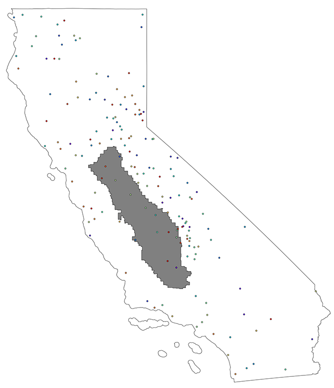
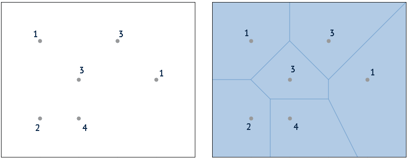
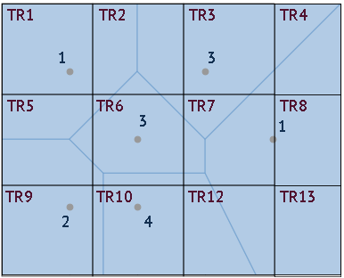
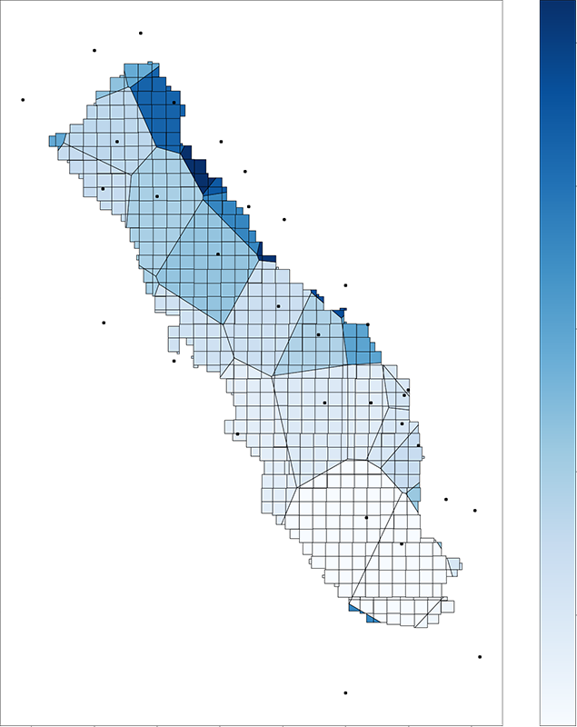

# Transforming Point Values into Township-Range Values
## What is the Problematic?
Some of the data are collected and recorded in specific locations while we need them for all the townships of the San 
Joaquin Valley. An example is precipitation which is collected in weather stations, but there is not one weather station
for every township. If we look at all the weather stations in the state of California, from which we were able to 
collect data, we get the following map. The San Joaquin Valley (in grey) which has 409 townships, only has 16 weather 
stations.

How do we fill in the data for the townships without weather stations ?

## Solution applied
According to these documentations
* [Science Direct - Voronoi Diagram](https://www.sciencedirect.com/topics/earth-and-planetary-sciences/voronoi-diagram)
* [precipitation measurements](https://www.weather.gov/abrfc/map) from the U.S. National Weather Service, 

the _Thiessen polygon_ map or _Voronoi diagram_ method _"are employed by many disciplines including weather forecasters,
hydrologists and geographers, and by geologists in the mining sector, who use them to estimate resource volumes from 
exploratory boreholes"_. We decided to use this method to perform such estimates of area measurements from point
measurements.

Python's `shapely` library has a built-in `voronoid_diagram()` function making it easy, given any station measurement to 
build the _Thiessen polygons_ for the Voronoi Diagram.

## How does it work?
Taking a set of point measurements, a _[Voronoi diagram](https://en.wikipedia.org/wiki/Voronoi_diagram)_ is computed. 
The Voronoi Diagram is made of _Thiessen polygons_ representing the regions close to each of the point measurements.

We then overlay the Township-Range boundaries on top of the Voronoi diagram and calculate the mean of the polygon values
within the townships. In the example below:
* Township-Range TR1, which includes the point measurement with value 1, would have a value of 1
* Likewise township TR9 would have a value of 2
* Township-Range TR13, which includes no point measurement and is included in a _Thiessen polygon_, would have the value of 1 
which is the value of the point measurement of that polygon
* Township-Range TR5 which overlays 3 _Thiessen polygons_ would have the value equal to the mean of the three polygons it 
crosses. That is (3+2+1)/3=2
* Likewise township TR6 would have a value of (1+3+3+4+2)/5=2.6

## Result
The result of the average precipitations per township for the year 2021 in the San Joaquin Valley is as follow.

## Code 
Please refer to the `compute_areas_from_points()` function in the `wsdatasets` library [here](lib/wsdatasets.py). 
