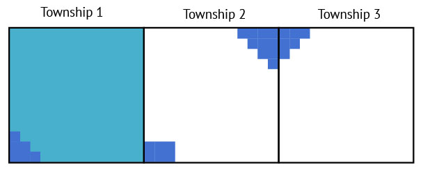

# Squaring San Joaquin Valley Township-Ranges
## Problem statement
To filter data from the San Joaquin Valley in the various geospatial dataset we collected for the state of California, 
we reused the [TRS](doc/etl/township_overlay.md) geospatial data from the L.A Times which motivated this analysis.

However in several Townships-Range map units, the shapes are made of:
* multiple adjacent polygons as in the "Township 1" example below
* multiple disconnected polygons as in the "Township 2" example below
* incomplete Township-Range shapes on the outer regions of the San Joaquin Valley

When overlaying these Township-Ranges boundaries on other datasets (e.g. soils dataset, crops dataset, etc.) these 
complex muli-polygons generate several problems:
* data loss in Township-Ranges with incomplete shapes (e.g. township 2 below)
* increased computation time, e.g. Township-Ranges 1 and 2 below require 2 boundaries overlay instead of 1 and the data 
resulting from the 2 overlays need to be re-aggregated

## Solution applied
To solve the above problems all the Township-Range boundaries have been squared as follow:
1. All the points from all the shapes in a township are extracted
2. A [convex hull](https://en.wikipedia.org/wiki/Convex_hull) is computed on these points to generate the smallest
convex shape containing all the points in the Township-Ranges

The result for the 3 example Township-Ranges is as follow:

3. Then, a square bounding box is applied to the convex shape of each township

Note that for Township-Ranges on the outer regions of the San Joaquin Valley (e.g. "Township 3" above) we do not try to 
expand the shape to the full township surface. Such an operation would be irrelevant as the objective is not to have 
the shape fully match township boundaries but have 1 shape per township which ensure that we properly filter all the San
Joaquin Valley data in the correct Township-Ranges.

## Result
The original San Joaquin Valley TRS dataset from the L.A. Times contains the following Township-Ranges:

After squaring all the Township-Ranges we get the below reults:
* the within-township borders which can be seen in the original data above have disappeared
* the holes which can be seen in the original data above have disappeared
* the Township-Ranges on the outer region have been simplified
* a negative side effect of squaring the township shapes to their outermost square boundaries is that some township
shapes slightly overlap. This means that some map data will be duplicated in two Township-Ranges. But this overlapping 
appears to be very limited and has thus been ignored
* there is still one empty area in the map. This land surface represents 0.076% of the surface of the San Joaquin
Valley as computed by the above process. We have considered this negligible and decided to ignore it.

## Code 
Please refer to the `_square_township_shapes()` function in the `wsdatasets` library [here](lib/wsdatasets.py). 
