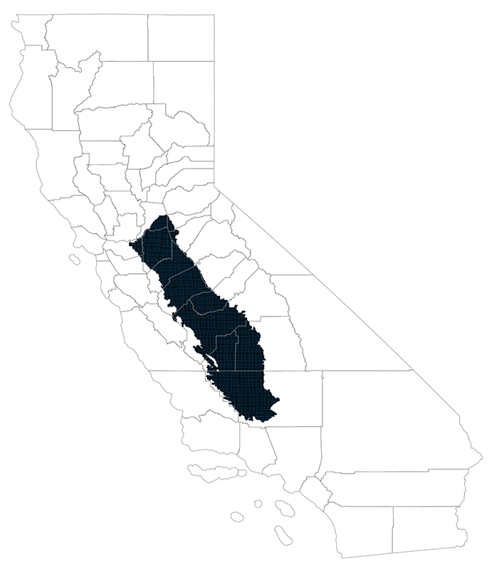

# Overlaying San Joaquin Valley Township-Range Boundaries
To conduct the analysis of water shortage in the San Joaquin Valley, the geographic unit chosen is the _township range_
in the Township, Range and Section (TRS) land survey system. We use the San Joaquin Valley Township boundaries as
defined by the [L.A. Times GitHub repository](https://github.com/datadesk/groundwater-analysis) for the news article
which motivated this analysis.

## What is the TRS system?
The __Township, Range and Section__ or __TRS__ boundaries is a United States public land survey system. The basic unit
of the system is the _Section_, a square piece of land one mile by one mile containing 640 acres. 36 sections arranged
in a 6 by 6 square make a Township.

## The San Joaquin Valley Townships in California

## A zoom in the San Joaquin Valley Township boundaries

## Overlaying Township boundaries on Datasets
The TRS system is used for public survey but the Township boundaries do no match the "natural" boundaries of crops
farming fields, forest vegetation area coverage, areas of similar soil type or census organisation in counties, tracts
and blocks.

For our analysis we this need to compute from data with natural boundaries the corresponding values at the Township
level.

### How can we accomplish this?

Here is an illustration of how this is done on various datasets: crops, vegetation, soils, population.

Using GeoPandas the two datasets in that illustration (crops and townships) will be as follow:

The crops dataset

| LAND_ID | CROP_TYPE | geometry                                     |
|---------|-----------|----------------------------------------------|
| C1      | V         | POLYGON((0,0), (0,2), (1.5,2), (1,1))        |
| C2      | D         | POLYGON((0,0), (1,1), (1.5,2), (2,2), (2,0)) |

The township dataset

| TOWNSHIP | geometry                            |
|----------|-------------------------------------|
| T1 R1    | POLYGON((0,1), (0,2), (1,2), (1,1)) |
| T2 R1    | POLYGON((1,2), (2,2), (2,1), (1,1)) |
| T3 R1    | POLYGON((0,0), (0,1), (1,1), (1,0)) |
| T4 R1    | POLYGON((1,0), (1,1), (2,1), (2,0)) |

Using GeoPandas _identity_ overlay method, it is possible to subdivide the crops dataset
based on the township dataset (see the documentation [here](https://geopandas.org/en/stable/docs/user_guide/set_operations.html#the-different-overlay-operations)).
The result consists of the surface of the crops datasets subdivided by the township
boundaries as follow:

| LAND_ID | CROP_TYPE | TOWNSHIP | geometry                              |
|---------|-----------|----------|---------------------------------------|
| C1      | V         | T1 R1    | POLYGON((0,0), (0,2), (1.5,2), (1,1)) |
| C1      | V         | T2 R1    | POLYGON((1,1), (1,2), (1.5,2))        |
| C1      | V         | T3 R1    | POLYGON((0,0), (0,1), (1,1))          |
| C2      | D         | T3 R1    | POLYGON((0,0), (1,1), (1,0))          |
| C2      | D         | T2 R1    | POLYGON((1,1), (1.5,2), (2,2), (2,1)) |
| C2      | D         | T4 R1    | POLYGON((1,0), (1,1), (2,1), (2,0))   |

Here is an example of the result when applied to the 2018 Crops dataset (here we zoomed in on a section of the map for
clarity)

Based on the polygon surface, it is then possible to compute which surface percentage of a township a crop is taking
which would result in the following dataset

| LAND_ID | CROP_TYPE | TOWNSHIP | AREA_PCT | geometry                              |
|---------|-----------|----------|----------|---------------------------------------|
| C1      | V         | T1 R1    | 1        | POLYGON((0,0), (0,2), (1.5,2), (1,1)) |
| C1      | V         | T2 R1    | 0.25     | POLYGON((1,1), (1,2), (1.5,2))        |
| C1      | V         | T3 R1    | 0.5      | POLYGON((0,0), (0,1), (1,1))          |
| C2      | D         | T3 R1    | 0.5      | POLYGON((0,0), (1,1), (1,0))          |
| C2      | D         | T2 R1    | 0.75     | POLYGON((1,1), (1.5,2), (2,2), (2,1)) |
| C2      | D         | T4 R1    | 1        | POLYGON((1,0), (1,1), (2,1), (2,0))   |

By pivoting the table, using the CROP_TYPE as new columns and the AREA_PCT percentage as values we get the percentage
of land surface used for each crop type in each township boundaries.

| TOWNSHIP | V_CROP | D_CROP | geometry                            |
|----------|--------|--------|-------------------------------------|
| T1 R1    | 1      | 0      | POLYGON((0,1), (0,2), (1,2), (1,1)) |
| T2 R1    | 0.25   | 0.75   | POLYGON((1,2), (2,2), (2,1), (1,1)) |
| T3 R1    | 0.5    | 0.5    | POLYGON((0,0), (0,1), (1,1), (1,0)) |
| T4 R1    | 0      | 1      | POLYGON((1,0), (1,1), (2,1), (2,0)) |