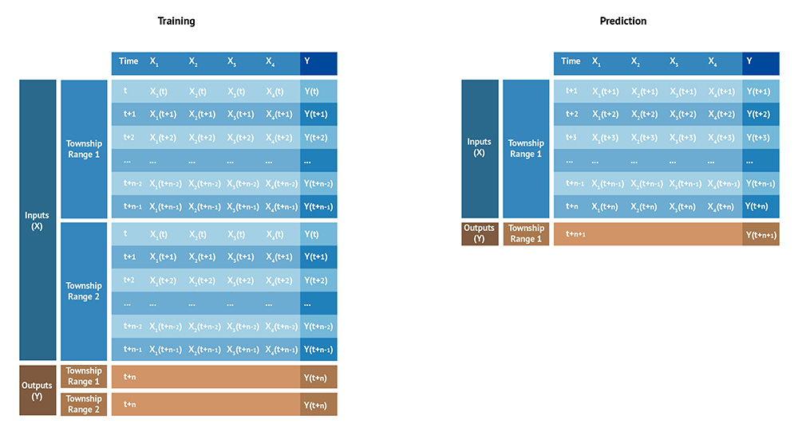
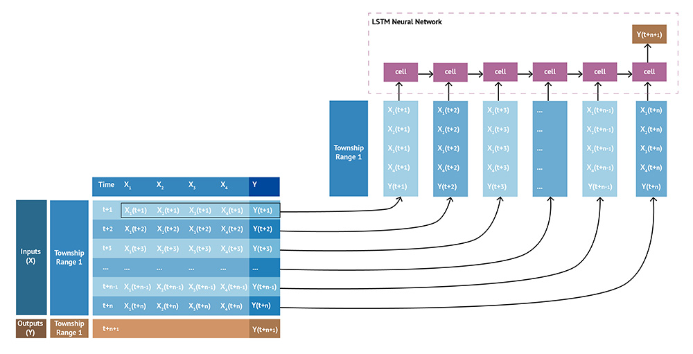

# Multi-Variate Multi Time-Series Predictions with LSTM
## The Data
In a multi-variate multi time-series prediction problem, the inputs are 3 dimensional, made of multiple subjects, 
each characterized by several features (X1 - X4 and Y), each being a time-series.
In this example, the objective is to predict the value of the feature Y, one step into the future *Y(t+n+1)*. This is a
many-to-one prediction problem with a prediction window of 1 time stamp. The same approach can be used to predict 
multiple features (many-to-many prediction problem) and multiple time-steps into the future. 

LSTMs are used for time series and NLP because they are both sequential data and depend on previous states.
The future prediction *Y(t+n+1)* depends not only on the last state *X1(t+n) - Y(t+n)*, not only on past values of the 
feature *Y(t+1) - Y(t+n)*, but on the entire past states sequence.

Example of such multi-variate multi time-series:
* IoT devices collecting multiple metrics over time.
* A server farm, each measuring CPU, memory, disk IO usage over time.
* Retail stores sales of multiple products over time, etc.

In our case, the dataset is made of 478 Township-Ranges, each containing a multi-variate (80 features) time-series 
(data between 2014 to 2021) resulting in a dataset of $478 TownshipRanges * 8 time stamps * 80 features$

The objective is to predict the 2022 target value of `GSE_GWE` (Ground Surface Elevation to Groundwater Water Elevation 
- Depth to groundwater elevation in feet below ground surface) for each Township-Range.

## Feeding the LSTM Model
LSTM models are often explained with NLP examples. Using this as an analogy, here
* subjects (sentences) are passed into the model
* each cell in the LSTM neural network receives a subject’s state at a specific time
(a word, the state of the sentence at a specific position)
* each state in the series is represented by a multi-dimensional vector of all features
(the word vector), here X1 - X4 and Y.

This example shows a many-to-one LSTM model where the output is the subject’s next state for
the specific feature Y, one time stamp into the future (the next word in the sentence).

